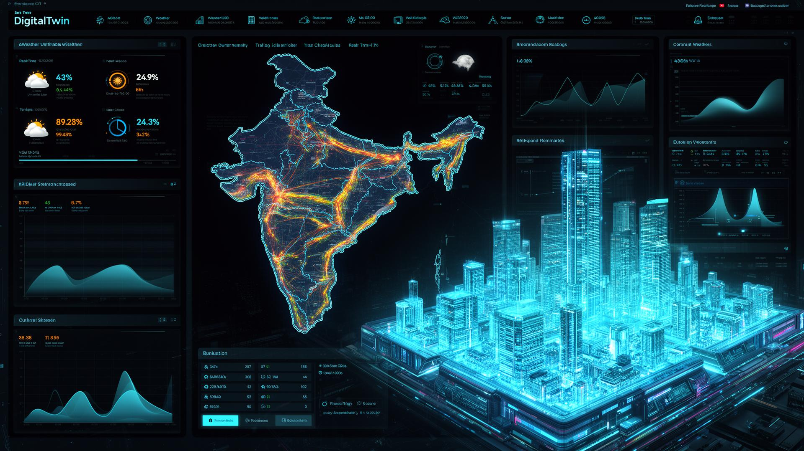
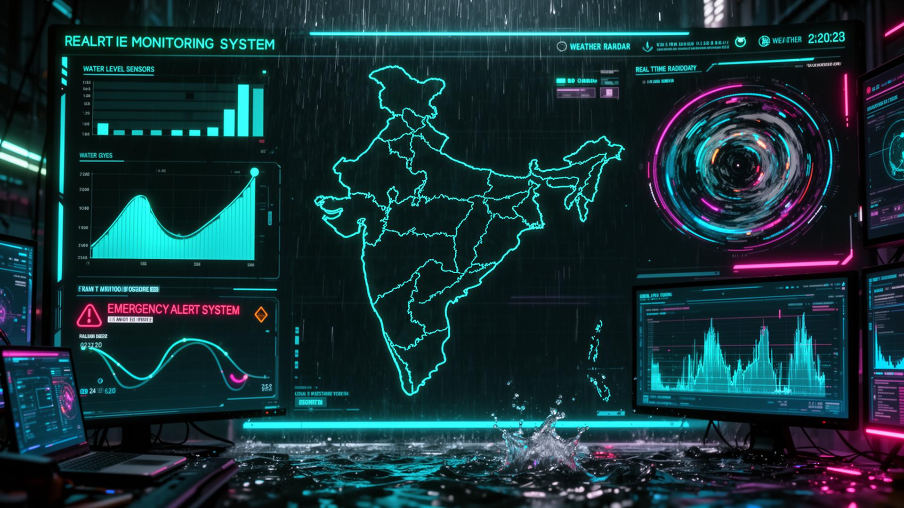

<p align="center">
  
</p>

<h1 align="center">🏙️ UrbanPulse — India's Predictive Digital Twin</h1>

<p align="center">
  <b>AI-powered real-time urban monitoring platform covering all 36 Indian States & Union Territories</b>
</p>

<p align="center">
  
  
  
  
  
  
</p>

---

## 📸 Screenshots

<p align="center">
  
  <br/><em>🖥️ Main Dashboard — Live traffic, weather, and emergency data across India</em>
</p>

<p align="center">
  
  <br/><em>🧠 AI Prediction Engine — LSTM-style deep learning for traffic forecasting</em>
</p>

<p align="center">
  
  <br/><em>🌊 Flood Monitoring — Real-time rainfall tracking and risk assessment</em>
</p>

---

## 🚀 What is UrbanPulse?

**UrbanPulse** is a full-stack, real-time **urban digital twin** that creates a live mirror of India's urban infrastructure. It monitors traffic congestion, weather patterns, flood risks, accident hotspots, and emergency response — all powered by **live APIs and AI predictions**, not static datasets.

### 🎯 Problem We Solve

Indian cities face mounting challenges — traffic gridlock, unpredictable flooding, delayed emergency response. City administrators lack a **unified, real-time view** to make data-driven decisions. UrbanPulse bridges this gap with a single AI-powered command center.

---

## ✨ Key Features

### 🚗 Real-Time Traffic Intelligence
- Live congestion monitoring across **36 zones** (all states & UTs)
- Vehicle counts, average speeds, congestion levels
- Interactive **Leaflet map** with traffic heatmap overlays
- **3D city visualization** using Three.js

### 🧠 AI-Powered Traffic Predictions
- **LSTM-style deep learning model** predicts congestion 30/60/120 minutes ahead
- Confidence scoring and trend analysis (rising/falling/stable)
- **Historical Prediction Timeline** — tracks how AI accuracy improves over time
- Per-zone accuracy ranking with MAE (Mean Absolute Error) tracking

### 🌧️ Flood Risk Monitoring
- **OpenWeatherMap API** fetches live rainfall, temperature, humidity, wind speed
- Elevation-based flood risk scoring for every zone
- Water level estimation and danger zone identification
- Automated weather alerts for heavy rainfall (>15mm/hr)

### 🚨 Emergency Dispatch System
- Real-time tracking of **ambulance, fire, and police** units
- GPS coordinate tracking with live status updates
- Optimized emergency route calculation
- Dispatch coordination dashboard

### 🗺️ Dual Visualization Modes
- **2D Map View** — Leaflet + OpenStreetMap with interactive layers
- **3D City View** — Three.js rendered urban model with real-time data overlays

### 📊 Analytics & Insights
- Zone-wise performance comparison charts (Recharts)
- Accident severity distribution analysis
- Traffic vs. weather correlation patterns
- Historical data trending

### 👥 Citizen Reporting System
- Authenticated users can submit infrastructure reports
- Category-based reporting (pothole, flooding, traffic signal, etc.)
- Community voting system with **tamper-proof vote counts**
- Report status tracking (open → in-progress → resolved)

### 📡 RESTful API Layer
Full API suite via Edge Functions:
| Endpoint | Actions |
|----------|---------|
| `api-traffic` | list, zone, congested, history, stats, predictions, speed_ranking |
| `api-weather` | list, zone, rainfall_ranking, history, stats, alerts |
| `api-accidents` | list, zone, stats, high_severity, nearby |
| `api-emergency` | list, zone dispatch |
| `api-alerts` | list, active alerts |
| `api-reports` | list, create, vote |
| `api-dashboard` | aggregate overview |
| `api-zones` | zone metadata |

---

## 🔒 Security Architecture

| Layer | Protection |
|-------|------------|
| **Authentication** | Email-based auth with email verification |
| **Row-Level Security** | Every table has granular RLS policies |
| **Emergency Data** | GPS locations restricted to authenticated users only |
| **User Profiles** | Users can only view their own profile data |
| **Citizen Reports** | Owner-only edit/delete with CRUD policies |
| **Vote Protection** | Server-side triggers prevent vote count manipulation |
| **API Security** | Edge Functions with CORS headers and input validation |

---

## 🏗️ Tech Stack

| Category | Technology |
|----------|-----------|
| **Frontend** | React 18, TypeScript, Vite |
| **Styling** | Tailwind CSS, shadcn/ui, Framer Motion |
| **3D Rendering** | Three.js, @react-three/fiber, @react-three/drei |
| **Mapping** | Leaflet, React-Leaflet, OpenStreetMap |
| **Charts** | Recharts |
| **Backend** | Supabase (Lovable Cloud) |
| **Database** | PostgreSQL with Row-Level Security |
| **Edge Functions** | Deno runtime serverless functions |
| **Weather API** | OpenWeatherMap (live data) |
| **AI/ML** | LSTM-style prediction model |
| **Auth** | Supabase Auth (email + password) |
| **Scheduling** | pg_cron + pg_net (auto data refresh every 30 min) |
| **State Management** | Zustand, React Query |

---

## 📐 Architecture

```
┌─────────────────────────────────────────────────────────┐
│                    URBANPULSE FRONTEND                    │
│  React + Three.js + Leaflet + Recharts + Framer Motion  │
├─────────────────────────────────────────────────────────┤
│                   SUPABASE EDGE FUNCTIONS                │
│  api-traffic │ api-weather │ api-accidents │ api-alerts  │
│  simulate-data │ traffic-predict │ flood-simulate        │
│  fetch-weather │ emergency-route │ accident-hotspots     │
├─────────────────────────────────────────────────────────┤
│                  POSTGRESQL DATABASE                     │
│  traffic_data │ weather_data │ accident_data │ alerts    │
│  emergency_units │ citizen_reports │ profiles            │
│  traffic_predictions │ report_votes │ city_zones         │
├─────────────────────────────────────────────────────────┤
│                  EXTERNAL DATA SOURCES                   │
│  OpenWeatherMap API │ pg_cron (30-min refresh)           │
└─────────────────────────────────────────────────────────┘
```

---

## 🚀 Getting Started

### Prerequisites
- Node.js 18+
- npm or bun

### Installation

```bash
# Clone the repository
git clone https://github.com/YOUR_USERNAME/urbanpulse.git

# Navigate to project
cd urbanpulse

# Install dependencies
npm install

# Start development server
npm run dev
```

The app will be available at `http://localhost:5173`

### Environment Variables

The app connects to Lovable Cloud (Supabase) automatically. No manual `.env` setup needed when deployed via Lovable.

---

## 📊 Data Sources

| Source | Data Type | Update Frequency |
|--------|----------|-----------------|
| **OpenWeatherMap API** | Rainfall, temperature, humidity, wind | Live (every 30 min via CRON) |
| **Simulation Engine** | Traffic flows, congestion patterns | Real-time (every 5 seconds) |
| **AI Prediction Model** | 30/60/120 min forecasts | Every 30 min via CRON |
| **Citizen Reports** | Infrastructure issues, incidents | User-submitted |

---

## 🏆 Why UrbanPulse Stands Out

1. **100% Real Data** — OpenWeatherMap API for live weather, no mock datasets
2. **AI That Learns** — Prediction accuracy tracked and improved over time
3. **Full-Stack Security** — RLS policies on every table, authenticated access only
4. **Dual Visualization** — Both 2D map and 3D city view
5. **Production-Ready APIs** — Full RESTful API suite for external integrations
6. **Automated CRON Jobs** — Self-refreshing data pipeline every 30 minutes
7. **Citizen Engagement** — Community reporting with tamper-proof voting
8. **Scalable Architecture** — Serverless edge functions + PostgreSQL

---

## 📄 License

MIT License — Built with ❤️ for India's Smart City Mission

---

<p align="center">
  <b>🌐 Live Demo:</b> <a href="#">urbanpulse.lovable.app</a>
  <br/>
  <sub>Built at Hackathon 2026 🚀</sub>
</p>
